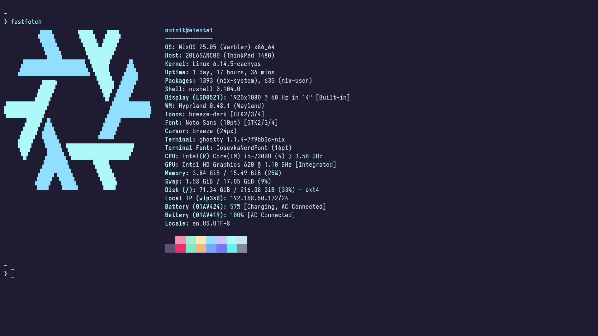

# ghostty
A ghostty theme for the ambitious



## How to use
Edit your ghostty config file (usually located at `$XDG_CONFIG_HOME/ghostty/config`) and add the following line at the bottom:
```
config-file = embark-theme
```

---
See other ports at https://embark-theme.github.io/
